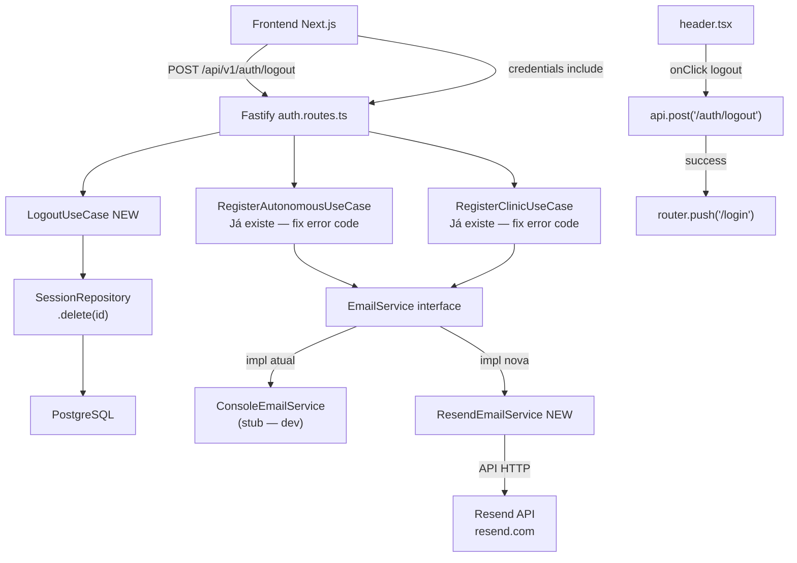

# F01 — Autenticação e Acesso: Design

**Spec**: `.specs/features/auth/spec.md`
**Status**: Draft

---

## Descobertas do Brownfield

Antes de decidir o que construir, a análise do código revelou o estado real:

| Gap identificado no Spec | Realidade encontrada no código |
|---|---|
| "CPF sem validação de dígitos" | ❌ FALSO — `validateCpf()` já existe em `register-autonomous.use-case.ts` com algoritmo completo |
| "CNPJ sem validação de dígitos" | ❌ FALSO — `validateCnpj()` já existe em `register-clinic.use-case.ts` com algoritmo completo |
| CPF/CNPJ inválido retorna erro genérico | ✅ REAL — lança `new Error('Invalid CPF')` em vez de `IdentityError` → routes.ts mapeia para 500 |
| Logout não existe | ✅ REAL — `SessionRepository` tem `delete()` e `deleteByUserId()` mas não há endpoint |
| Email service é stub | ✅ REAL — `ConsoleEmailService` apenas loga; nenhuma lib de envio instalada |
| Frontend sem botão de logout | ✅ REAL — `header.tsx` e `sidebar.tsx` não têm ação de logout |

**Conclusão:** O escopo de implementação é menor do que parecia. A lógica core de auth já está sólida.

---

## Architecture Overview



---

## Code Reuse Analysis

### Componentes existentes a reutilizar

| Componente | Localização | Como usar |
|---|---|---|
| `SessionRepository.delete()` | `src/identity/domain/ports.ts` + `src/infrastructure/persistence/prisma/session.repository.ts` | Chamar no `LogoutUseCase` — método já existe |
| `SessionRepository.findByToken()` | Idem | Resolver sessão pelo cookie antes de deletar |
| `IdentityError` + subclasses | `src/identity/domain/errors.ts` | Adicionar `InvalidDocumentError`; usar padrão existente |
| `handleError()` em `auth.routes.ts` | `src/identity/adapters/http/auth.routes.ts:34` | Já converte `IdentityError` → 400/401; fix faz CPF/CNPJ entrar nesse fluxo |
| `EmailService` interface | `src/identity/application/use-cases/register-autonomous.use-case.ts:33` | Implementar com Resend mantendo mesma interface |
| `ConsoleEmailService` | `src/infrastructure/auth/console-email-service.ts` | Manter para dev; `ResendEmailService` para prod |
| `PUBLIC_ROUTES` + `configureAuth` | `src/infrastructure/http/middleware/auth.ts` | Adicionar `/api/v1/auth/logout` a PUBLIC_ROUTES não — deve ser protegida |
| `api.post()` | `frontend/src/lib/api.ts` | Chamar logout do frontend; mesma função genérica |

### Integration Points

| Sistema | Método de integração |
|---|---|
| Prisma `Session` model | `SessionRepository.delete(id)` — já funcional no Prisma |
| Cookie `session` | Fastify reply: `Set-Cookie: session=; Max-Age=0` para limpar |
| Resend API | `fetch` direto ou SDK `resend` npm package → implementa `EmailService` |

---

## Componentes

### 1. `InvalidDocumentError` (novo erro de domínio)

- **Propósito**: Erro tipado para CPF/CNPJ inválido, substituindo `new Error()` genérico
- **Localização**: `src/identity/domain/errors.ts`
- **Interface**:
  ```typescript
  export class InvalidDocumentError extends IdentityError {
    constructor(documentType: 'CPF' | 'CNPJ') {
      super(`Invalid ${documentType} format or check digits`, `INVALID_${documentType}`);
    }
  }
  ```
- **Dependências**: `IdentityError` (já existe)
- **Reutiliza**: Padrão idêntico ao `DocumentAlreadyExistsError` na mesma linha

### 2. Fix `validateCpf` / `validateCnpj` — lançar `InvalidDocumentError`

- **Propósito**: Fazer erro de CPF/CNPJ inválido retornar 400 com código correto em vez de 500
- **Localização**:
  - `src/identity/application/use-cases/register-autonomous.use-case.ts:62`
  - `src/identity/application/use-cases/register-clinic.use-case.ts:64`
- **Mudança cirúrgica**:
  ```typescript
  // ANTES
  if (!this.validateCpf(input.cpf)) {
    throw new Error('Invalid CPF');
  }
  // DEPOIS
  if (!this.validateCpf(input.cpf)) {
    throw new InvalidDocumentError('CPF');
  }
  ```
- **Dependências**: `InvalidDocumentError` (novo)
- **Sem mudança** na lógica de validação — `validateCpf()` e `validateCnpj()` já estão corretos

### 3. `LogoutUseCase` (novo use case)

- **Propósito**: Invalidar sessão no banco e sinalizar limpeza do cookie
- **Localização**: `src/identity/application/use-cases/logout.use-case.ts`
- **Interface**:
  ```typescript
  export interface LogoutInput {
    sessionToken: string; // valor do cookie
  }

  export class LogoutUseCase {
    constructor(private readonly sessionRepository: SessionRepository) {}

    async execute(input: LogoutInput): Promise<void> {
      const session = await this.sessionRepository.findByToken(input.sessionToken);
      if (session) {
        await this.sessionRepository.delete(session.id);
      }
      // Silencioso se sessão não existe — idempotente
    }
  }
  ```
- **Dependências**: `SessionRepository` (já existe e tem `findByToken` + `delete`)
- **Reutiliza**: Mesma injeção via constructor usada em `LoginUseCase`

### 4. `POST /api/v1/auth/logout` (nova rota)

- **Propósito**: Endpoint HTTP que recebe requisição de logout e limpa cookie
- **Localização**: `src/identity/adapters/http/auth.routes.ts` — adicionar dentro de `authRoutes()`
- **Interface**:
  ```typescript
  fastify.post('/api/v1/auth/logout', async (request, reply) => {
    const sessionToken = request.cookies.session;
    if (sessionToken) {
      await logoutUseCase.execute({ sessionToken });
    }
    reply
      .header('Set-Cookie', 'session=; HttpOnly; Max-Age=0; Path=/; SameSite=Strict')
      .code(200)
      .send({ message: 'Logged out' });
  });
  ```
- **Nota**: Rota deve **entrar em PUBLIC_ROUTES** — usuário com sessão expirada ainda precisa conseguir fazer logout
- **Dependências**: `LogoutUseCase`, `PrismaSessionRepository`, cookie parser (já configurado)
- **Reutiliza**: Padrão de todas as outras rotas em `auth.routes.ts`; `AuthRoutesConfig` precisa de `sessionRepository` (já tem)

### 5. `ResendEmailService` (nova implementação)

- **Propósito**: Implementação real de `EmailService` via Resend API para produção
- **Localização**: `src/infrastructure/auth/resend-email-service.ts`
- **Interface**:
  ```typescript
  export class ResendEmailService implements EmailService {
    constructor(private readonly apiKey: string, private readonly fromEmail: string) {}

    async sendConfirmationEmail(email: string, token: string, userName: string): Promise<void>
    async sendPasswordResetEmail(email: string, token: string, userName: string): Promise<void>
    async sendInviteEmail(email: string, token: string, inviterName: string, tenantName: string): Promise<void>
  }
  ```
- **Transporte**: SDK oficial `resend` (`npm install resend`) — envolve `fetch` com tipagem
- **Configuração**: `RESEND_API_KEY` + `EMAIL_FROM` env vars; fallback para `ConsoleEmailService` se `RESEND_API_KEY` não definido
- **Template**: HTML simples com link de ação — sem template engine externa no MVP
- **Dependências**: `resend` npm package; `EmailService` interface (já existe)
- **Reutiliza**: Mesma interface `EmailService` — `main.ts` só troca instância injetada

### 6. Wiring condicional em `main.ts`

- **Propósito**: Escolher implementação de e-mail baseado em variável de ambiente
- **Localização**: `src/main.ts` (adição de ~5 linhas)
- **Lógica**:
  ```typescript
  const emailService = process.env.RESEND_API_KEY
    ? new ResendEmailService(process.env.RESEND_API_KEY, process.env.EMAIL_FROM ?? 'noreply@seudominio.com')
    : new ConsoleEmailService();
  ```
- **Sem mudança** nos use cases — injeção de dependência cobre isso transparentemente

### 7. Botão de logout no Frontend

- **Propósito**: Ação de logout acessível no header ou sidebar do dashboard
- **Localização**: `frontend/src/components/layout/header.tsx` (ou `sidebar.tsx`)
- **Interface**:
  ```typescript
  async function handleLogout() {
    await api.post('/auth/logout');
    router.push('/login');
  }
  ```
- **UX**: Botão/item de menu no avatar dropdown → "Sair" → `handleLogout()` → redirect `/login`
- **Edge case**: Se `api.post('/auth/logout')` falhar (rede) → redirecionar mesmo assim (cookie expira naturalmente)
- **Dependências**: `api.post` (já existe), `useRouter` do Next.js

---

## Data Models

Nenhum model novo. Estruturas existentes cobrem tudo:

```typescript
// Já existe — Session em src/identity/domain/entities.ts
interface Session {
  id: string;
  userId: string;
  tenantId: string;
  token: string;    // valor do cookie — usado para lookup no logout
  expiresAt: Date;
  createdAt: Date;
}
```

**Para Resend:** sem model — API calls são stateless, sem persistência local de e-mails.

---

## Error Handling Strategy

| Cenário de erro | Tratamento | O que o usuário vê |
|---|---|---|
| CPF inválido no cadastro | `InvalidDocumentError('CPF')` → `auth.routes.ts handleError()` → 400 `INVALID_CPF` | "CPF inválido" no formulário |
| CNPJ inválido no cadastro | `InvalidDocumentError('CNPJ')` → 400 `INVALID_CNPJ` | "CNPJ inválido" no formulário |
| Logout com sessão já expirada | `LogoutUseCase` silencioso (idempotente) → 200 | Usuário é redirecionado para `/login` normalmente |
| Logout sem cookie | Mesma lógica — `sessionToken` undefined → skip delete → 200 + clear cookie | Redirect para `/login` |
| Falha no envio de e-mail (Resend) | `ResendEmailService` relança exceção → `RegisterUseCase` propaga → 500 | "Erro ao enviar e-mail, tente novamente" |
| `RESEND_API_KEY` não configurado | Usa `ConsoleEmailService` como fallback — não quebra | E-mail logado no console (dev) |
| Logout frontend com erro de rede | Redirecionar para `/login` mesmo assim | Sessão fica no banco até expirar (aceitável) |

---

## Tech Decisions

| Decisão | Escolha | Justificativa |
|---|---|---|
| Provedor de e-mail | **Resend** (`resend` npm) | Free tier generoso (3k e-mails/mês), API simples, SDK TypeScript nativo, sem SMTP config; alinhado com Next.js ecosystem |
| Logout use case vs inline na rota | **`LogoutUseCase`** | Consistência com arquitetura hexagonal; testável isolado; padrão estabelecido no projeto |
| `InvalidDocumentError` vs reuso de `DocumentAlreadyExistsError` | **Novo erro** | Semântica diferente: "formato inválido" ≠ "já existe"; código de erro distinto no frontend |
| Rota `/logout` em PUBLIC_ROUTES | **Sim** | Usuário com sessão expirada (401 no middleware) ainda precisa conseguir fazer logout e limpar cookie |
| Template de e-mail | **HTML inline no MVP** | Sem dependência de template engine; suficiente para MVP; fácil de evoluir para React Email depois |
| Fallback de e-mail | **`ConsoleEmailService` se sem `RESEND_API_KEY`** | Zero configuração em dev; prod explode se key não configurada (fail fast é explícito via Resend SDK) |
